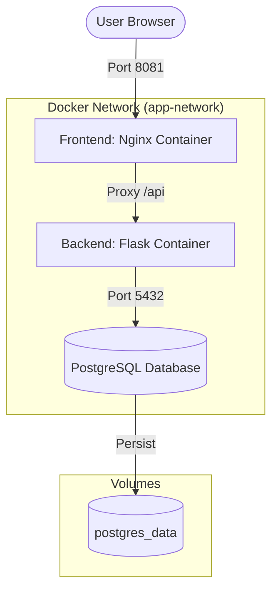

# Project Documentation: CI/CD Web Application

This document provides a technical overview of the 2-tier web application and the automated CI/CD pipeline.

## 1. System Architecture
The application follows a standard 2-tier architecture with a persistent database layer.

## 2. CI/CD Pipeline Flow
The pipeline is managed by Jenkins and follows these stages:

## 3. Docker Optimization (Multi-Stage Builds)
We used multi-stage builds to significantly reduce the final image size and improve security.

### How to verify image size reduction:
1. Open your terminal.
2. Run: `docker images`
3. Notice that the `capstone-app-backend` and `capstone-app-frontend` images are much smaller than a standard `python` or `nginx` image because the "builder" stage was discarded.

## 4. Deployment Runbook
- **Local Dev**: Run `docker-compose up --build`.
- **Staging (Jenkins)**: Click "Build Now" in Jenkins.
- **Stop**: Run `docker-compose down`.

## 5. Troubleshooting
| Issue | Solution |
| :--- | :--- |
| **Port Conflict** | Change the port in `docker-compose.yml` or run `docker-compose down`. |
| **Permission Denied** | Run `sudo chmod 666 /var/run/docker.sock`. |
| **Connection Error** | Ensure Nginx `nginx.conf` is correctly proxying `/api` to `backend:5000`. |
